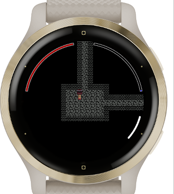
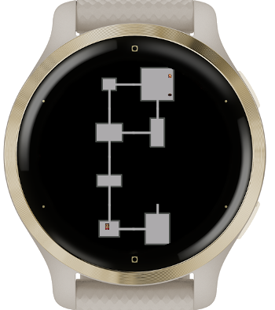
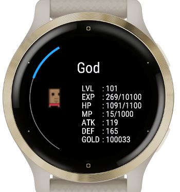
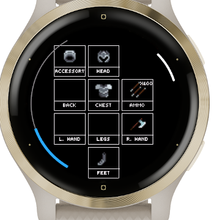

# Dungeon Crawler (Garmin watch game)

DungeonCrawler is a lightweight, turn-based roguelike built for Garmin watches (tested on the Venu 2S). You guide a hero through randomly generated dungeon rooms, collect loot, fight monsters, and descend deeper by finding the stairs.

## At a glance
- Short sessions: quick, turn-based moves suited to the watch form factor.
- Procedural dungeons: each run builds new room layouts with enemies, loot, merchants, and stairs.
- Character setup: pick a hero, view starting stats/gear, and name your character.
- Loot & gear: weapons, armor, consumables, and occasional high-quality items or treasure chests.
- Encounters: monsters populate rooms; difficulty scales as you descend.
- Merchants: rare rooms let you trade and restock between fights.
- Saves: manual save from the menu, optional autosave, and save-on-exit if enabled in settings.

## How to play
1. Install the app on your Garmin watch (Venu 2S supported), then start DungeonCrawler.
2. Create your hero: step through the character details screens, confirm, then enter a name.
3. Read the intro story, then the first room loads.
4. Move by tapping the screen in the direction you want to go (top = up, bottom = down, left = left, right = right). Each tap spends one turn.
5. Explore rooms: 
   - Fight monsters that block your path.
   - Pick up loot and open treasure chests.
   - Look for stairs to dive to the next dungeon depth.
   - Visit merchants when you find them to trade.
6. Press the watch’s menu button to open the in-game menu any time.
7. Climb the stairs to progress; deeper levels mean tougher foes but better rewards.

## Controls
- Tap screen quadrants to move: upper = up, lower = down, left side = left, right side = right.
- Menu button: opens the Game Menu (inventory, map, player details, save, log, settings).
- Back button: asks for confirmation to leave the game (it will save on exit if that option is enabled).

## On-screen indicators
- Red arc: your health.
- Second arc: resource bar for certain classes.
- Damage numbers briefly appear above your hero when you’re hit.

## Saving & loading
- Open the Game Menu and choose **Save** to manually save.
- Autosave can be enabled in Settings (either every turn or on a timer, depending on your choice).
- If “save on exit” is enabled, leaving the game from the back button prompt also saves.

## Tips for your first runs
- Avoid taking on multiple enemies at once—lure them into corridors.
- Open chests when you see them; high-quality gear is rare.
- Visit merchants before descending stairs to restock.
- Keep an eye on your health arc; retreat if it dips low.

## Screenshots

   
   
   
   
   

