# Dungeon Crawler

A turn-based roguelike for Garmin watches. Guide a hero through randomly generated dungeon rooms, collect loot, fight monsters, and descend deeper by finding the stairs.

   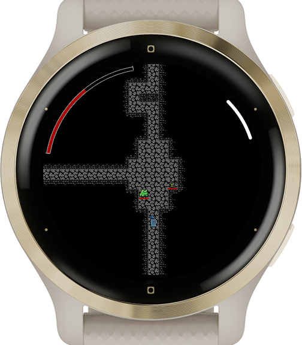
   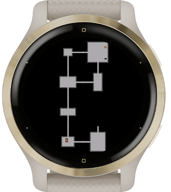
   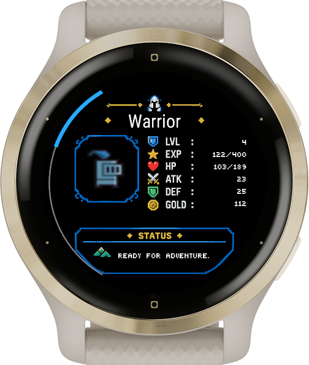
   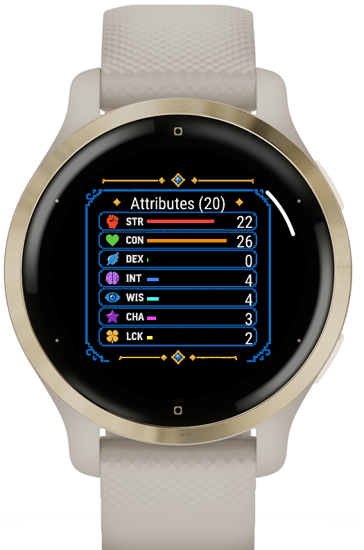
   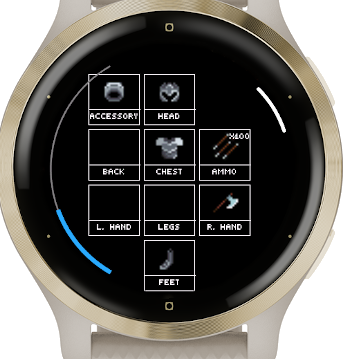

## Features

- **Short sessions** -- quick, turn-based moves suited to the watch form factor
- **Procedural dungeons** -- each run builds new room layouts with enemies, loot, merchants, and stairs
- **5 hero classes** -- Warrior, Mage, Archer, Nameless, Paladin (plus a debug God class)
- **165+ items** -- weapons, armor, consumables, treasure chests across 9 elemental tiers
- **38 enemy types** -- scaled by depth, with elemental variants and boss encounters
- **13 dungeon styles** -- visual themes with unique color palettes
- **Merchants & quests** -- trade gear, accept quests from NPCs, earn rewards
- **Save system** -- manual save, optional autosave, save-on-exit

## Hero Classes

   
   

| Class              | HP            | Mana        | Strengths                                     | Starting Gear                                  |
| ------------------ | ------------- | ----------- | --------------------------------------------- | ---------------------------------------------- |
| **Warrior**  | 150 (+13/lvl) | --          | High HP, balanced STR/CON                     | Steel Axe, Steel Breast Plate                  |
| **Mage**     | 38 (+8/lvl)   | 30 (+5/lvl) | High INT/WIS, ranged spells                   | Steel Staff, Steel Ring                        |
| **Archer**   | 30 (+11/lvl)  | --          | Extreme DEX, ranged attacks, extra ammo drops | Steel Bow, Steel Gauntlets, 20 Arrows          |
| **Nameless** | 150 (+12/lvl) | 15 (+4/lvl) | Balanced all stats, versatile                 | Steel Dagger, Life Amulet                      |
| **Paladin**  | 85 (+17/lvl)  | --          | Highest HP growth, tanky                      | Steel Dagger, Steel Shield, Steel Breast Plate |

### Attributes

7 attributes affect combat and gameplay: **TR** (melee damage), **CON** (defense/HP), **DEX** (ranged damage), **INT** (spell damage), **WIS** (defense/healing), **CHA** (defense), **LCK** (critical hit chance -- 25% for 1.25x multiplier).

## Dungeon Styles

   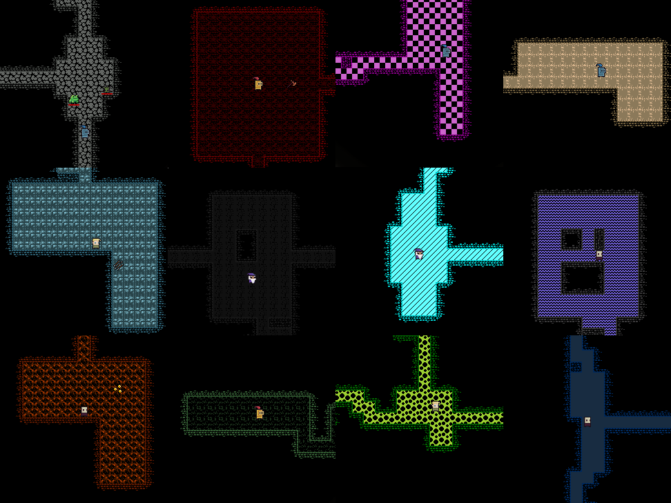

Each dungeon gets a random visual theme with unique floor tiles and color palettes.

## Enemies

38 enemy types across 4 difficulty tiers, each with unique AI behaviors:

   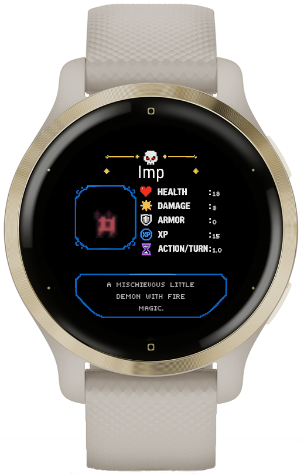

**Easy** -- Frog, Bat, Orc, Imp, Skeleton, Zombie, Goblins, Shadow Stalker, Gloom Lurker, Small Elementals (7 types)

**Normal** -- Necromancer (summons minions), Zombies, Armored Orcs, Shaman Orc (heals allies), Elementals (7 types, spawn small variants on death), Chort, Bies

**Hard** -- Wogol (teleports behind you), Dark Knight (flanking), Demonolog (summons), Armored Orc, Veteran Orc (glass cannon), Rokita

**Boss** -- Demon (teleports, no cooldown), Ogre (dash, massive HP), Tentackle (counter-clockwise strafe)

### AI Behaviors

Enemies use varied tactics: direct pursuit, flanking, strafing (circling), kiting (ranged), dashing (2-tile moves), teleporting, summoning minions, and healing allies.

## Items

165+ items across 9 elemental tiers:

   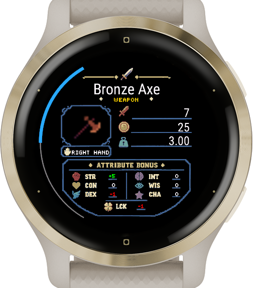

**Weapons** (9 types x 9 tiers): Axe, Bow, Dagger, Greatsword, Katana, Lance, Spell, Staff, Sword

**Elemental Tiers:** Steel, Bronze, Fire, Ice, Nature, Water, Gold, Demon, Blood

**Armor:** Helmets, Breast Plates, Gauntlets, Shoes, Rings, Shields (4 types), Backpacks (expand inventory)

**Consumables:** 6 potions (Health, Greater Health, Max Health, Mana, Greater Mana, Max Mana)

**Special:** Keys (open treasure chests), Gold (currency), Treasure Chests (random loot)

## Quests

   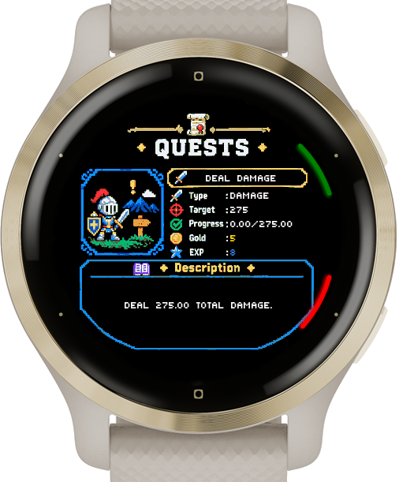

7 quest types including real-world fitness integration:

| Type          | Description               | Weight |
| ------------- | ------------------------- | ------ |
| Hunt Monsters | Slay X monsters           | 35%    |
| Deal Damage   | Deal X total damage       | 25%    |
| Endure Damage | Take X damage and survive | 10%    |
| Running       | Run for X minutes         | 10%    |
| Walk Stairs   | Climb X stairs            | 7%     |
| Cycling       | Bike X km                 | 6%     |
| Walking       | Walk X steps              | 7%     |

Up to 3 active quests simultaneously. Rewards scale with dungeon depth.

## Map Generation

- **Room shapes:** Rectangle (40%), L-shape (25%), T-shape (20%), Plus (10%), Rounded (5%)
- **Tunnels:** Procedural connections between rooms with curves
- **Islands:** Interior wall obstacles for tactical cover
- **Configurable:** Room count, min/max room size

## Save System

   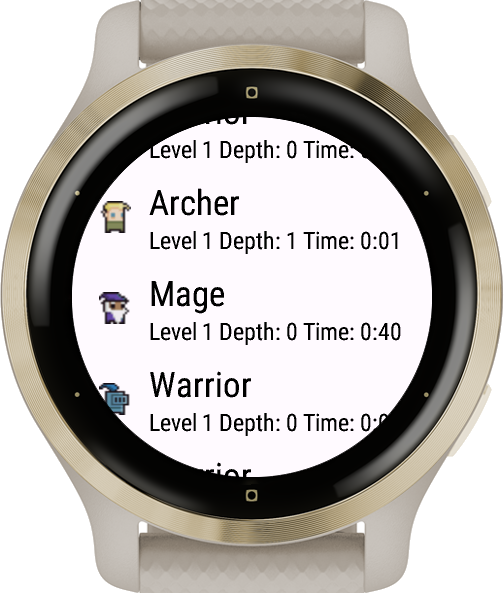

- Multiple save slots with metadata preview
- Manual save, autosave (every N turns/minutes), save-on-exit
- Compendium tracking (discovered enemies/items persist across saves)
- Delete individual saves

## Supported Devices

**Venu Series:** Venu 2, Venu 2S, Venu 2 Plus, Venu 3, Venu 3S, Venu 4 41mm, Venu 4 45mm, Venu Sq2, Venu Sq2m, Venu X1

**fenix Series:** fenix 7, fenix 7S, fenix 7X, fenix 7 Pro, fenix 7S Pro, fenix 7X Pro, fenix 7 Pro (no wifi), fenix 7X Pro (no wifi), fenix 8 43mm, fenix 8 47mm, fenix 8 Pro 47mm, fenix 8 Solar 47mm, fenix 8 Solar 51mm, fenix 9 43mm, fenix 9 47mm, fenix 9 Pro 43mm, fenix 9 Pro 47mm, fenix 9 Pro 51mm, fenix 9 Pro Solar 47mm, fenix 9 Pro Solar 51mm, fenix E

**Forerunner Series:** Forerunner 170, Forerunner 170m, Forerunner 265, Forerunner 265S, Forerunner 570 42mm, Forerunner 570 47mm, Forerunner 70, Forerunner 955, Forerunner 965, Forerunner 970

**Other:** epix 2, epix 2 Pro 42mm, epix 2 Pro 47mm, epix 2 Pro 51mm, MARQ 2, MARQ 2 Aviator, D2 Air X10, D2 Mach 1, D2 Mach 2, D2 Mach 2 Pro, Descent G2, Descent Mk3 43mm, Descent Mk3 51mm, Enduro 3, Approach S50, Approach S70 42mm, Approach S70 47mm, vivoactive 5, vivoactive 6

## How to Play

1. Start DungeonCrawler on your watch
2. Create your hero: pick a class, allocate attribute points, name your character
3. Move by tapping screen quadrants (top = up, bottom = down, left = left, right = right)
4. Fight monsters, pick up loot, open treasure chests
5. Find stairs to descend to the next dungeon depth
6. Visit merchants to buy/sell gear
7. Press the menu button for inventory, map, player details, and settings

## Movement

   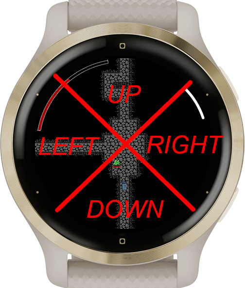

Movement is tap-based -- the screen is divided into four quadrants:

| Tap Area | Action |
|----------|--------|
| Upper screen | Move up |
| Lower screen | Move down |
| Left side | Move left |
| Right side | Move right |

Each tap moves your hero one tile in that direction. If an enemy is adjacent in the direction you tap, you attack instead of moving. Moving into a wall does nothing. After each player move, all enemies take their turn.

## On-Screen Indicators

- **Red arc** -- player health
- **Second arc** -- mana (Mage, Nameless) or class resource
- **Damage numbers** -- floating text above your hero when hit

## Documentation

Detailed documentation lives in [`documentations/`](documentations/):

| Document                                          | Description                                         |
| ------------------------------------------------- | --------------------------------------------------- |
| [Architecture](documentations/architecture.md)     | System overview, data flow, memory management       |
| [Engine](documentations/engine.md)                 | Game state, maps, turns, combat, entities           |
| [Player](documentations/player.md)                 | Classes, attributes, leveling, equipment            |
| [Enemies](documentations/enemies.md)               | Enemy types, AI, spawning, difficulty scaling       |
| [Items](documentations/items.md)                   | Item hierarchy, tiers, equipment slots              |
| [Map Generation](documentations/map-generation.md) | Room shapes, wall variants, dungeon styles          |
| [Frontend](documentations/frontend.md)             | UI layer, views, menus, controls                    |
| [Save/Load](documentations/save-load.md)           | Serialization, compendium, save slots               |
| [Testing](documentations/testing.md)               | Test framework, running tests                       |
| [Tooling](documentations/tooling.md)               | Balance scripts, MCP server, helpers                |
| [Build](documentations/build.md)                   | Build instructions, release process                 |
| [Dungeon Styles](documentations/dungeon-styles.md) | Visual themes, tile recommendations, color palettes |
