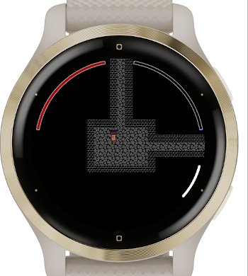
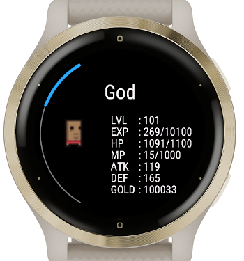
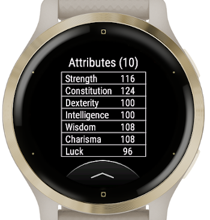

# Dungeon Crawler

A turn-based roguelike for Garmin watches. Guide a hero through randomly generated dungeon rooms, collect loot, fight monsters, and descend deeper by finding the stairs.

   
   
   
   
   

## Features

- **Short sessions** -- quick, turn-based moves suited to the watch form factor
- **Procedural dungeons** -- each run builds new room layouts with enemies, loot, merchants, and stairs
- **6 hero classes** -- Warrior, Mage, Archer, Nameless, Paladin (plus a debug God class)
- **150+ items** -- weapons, armor, consumables, treasure chests across 9 elemental tiers
- **38 enemy types** -- scaled by depth, with elemental variants and boss encounters
- **Dungeon styles** -- 13 visual themes (Fire, Ice, Shadow, Crystal, etc.) with unique color palettes
- **Merchants & quests** -- trade gear, accept quests from NPCs, earn rewards
- **Save system** -- manual save, optional autosave, save-on-exit

## Supported Devices

Venu 2, Venu 2S, Venu 2 Plus, Venu 3, Venu 3S, Venu 4 41mm, Venu 4 45mm

## How to Play

1. Start DungeonCrawler on your watch
2. Create your hero: pick a class, allocate attribute points, name your character
3. Move by tapping screen quadrants (top = up, bottom = down, left = left, right = right)
4. Fight monsters, pick up loot, open treasure chests
5. Find stairs to descend to the next dungeon depth
6. Visit merchants to buy/sell gear
7. Press the menu button for inventory, map, player details, and settings

## Controls

| Input | Action |
|-------|--------|
| Tap upper screen | Move up |
| Tap lower screen | Move down |
| Tap left side | Move left |
| Tap right side | Move right |
| Menu button | Open game menu |
| Back button | Exit game (with save prompt) |

## On-Screen Indicators

- **Red arc** -- player health
- **Second arc** -- mana (Mage, Nameless) or class resource
- **Damage numbers** -- floating text above your hero when hit

## Documentation

Detailed documentation lives in [`documentations/`](documentations/):

| Document | Description |
|----------|-------------|
| [Architecture](documentations/architecture.md) | System overview, data flow, memory management |
| [Engine](documentations/engine.md) | Game state, maps, turns, combat, entities |
| [Player](documentations/player.md) | Classes, attributes, leveling, equipment |
| [Enemies](documentations/enemies.md) | Enemy types, AI, spawning, difficulty scaling |
| [Items](documentations/items.md) | Item hierarchy, tiers, equipment slots |
| [Map Generation](documentations/map-generation.md) | Room shapes, wall variants, dungeon styles |
| [Frontend](documentations/frontend.md) | UI layer, views, menus, controls |
| [Save/Load](documentations/save-load.md) | Serialization, compendium, save slots |
| [Testing](documentations/testing.md) | Test framework, running tests |
| [Tooling](documentations/tooling.md) | Balance scripts, MCP server, helpers |
| [Build](documentations/build.md) | Build instructions, release process |
| [Dungeon Styles](documentations/dungeon-styles.md) | Visual themes, tile recommendations, color palettes |
