# Item Values

Current item stats, sprites and drop tables.

> Auto-generated by `tools/balance/generate_docs.py` from the source tree + `tools/balance/balance_report.json`. Do not edit manually; regenerate after balance changes with `python tools/balance/generate_docs.py`.

`Scales` is the attribute the stat scales with (`Attack` for weapons, `Defense` for armor).
`Bonus` lists flat attribute bonuses from `attribute_bonus`.

## Weapons

### Tier 0: Steel

| Image | Item | ID | Attack | Scales | Value | Weight | Bonus |
|---|---|---:|---:|---|---:|---:|---|
|  | [Steel Axe](../source/Engine/Items/WeaponItems/0_Steel/SteelAxe.mc) | 0 | 11 | STR | 10 | 2 | STR+4 DEX-1 luck-1 |
|  | [Steel Bow](../source/Engine/Items/WeaponItems/0_Steel/SteelBow.mc) | 1 | 8 | DEX | 10 | 1 | DEX+2 |
|  | [Steel Dagger](../source/Engine/Items/WeaponItems/0_Steel/SteelDagger.mc) | 2 | 10 | DEX | 10 | 0.5 | DEX+2 luck+2 |
|  | [Steel Greatsword](../source/Engine/Items/WeaponItems/0_Steel/SteelGreatsword.mc) | 3 | 16 | STR | 20 | 5 | STR+4 DEX-2 |
|  | [Steel Katana](../source/Engine/Items/WeaponItems/0_Steel/SteelKatana.mc) | 4 | 13 | STR | 10 | 3 | STR+2 DEX+2 |
|  | [Steel Spear](../source/Engine/Items/WeaponItems/0_Steel/SteelSpear.mc) | 5 | 13 | DEX | 10 | 2 | DEX+2 luck+2 |
|  | [Steel Spell](../source/Engine/Items/WeaponItems/0_Steel/SteelSpell.mc) | 6 | 11 | INT | 10 | 0.5 | WIS+2 |
|  | [Steel Staff](../source/Engine/Items/WeaponItems/0_Steel/SteelStaff.mc) | 7 | 8 | INT | 10 | 1 | INT+2 |
|  | [Steel Sword](../source/Engine/Items/WeaponItems/0_Steel/SteelSword.mc) | 8 | 13 | STR | 10 | 3 | STR+2 CON+1 |

### Tier 1: Bronze

| Image | Item | ID | Attack | Scales | Value | Weight | Bonus |
|---|---|---:|---:|---|---:|---:|---|
| 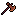 | [Bronze Axe](../source/Engine/Items/WeaponItems/1_Bronze/BronzeAxe.mc) | 10 | 16 | STR | 25 | 3 | STR+5 DEX-1 luck-1 |
|  | [Bronze Bow](../source/Engine/Items/WeaponItems/1_Bronze/BronzeBow.mc) | 11 | 12 | DEX | 25 | 2 | DEX+3 |
|  | [Bronze Dagger](../source/Engine/Items/WeaponItems/1_Bronze/BronzeDagger.mc) | 12 | 14 | DEX | 25 | 1 | DEX+3 luck+3 |
|  | [Bronze Greatsword](../source/Engine/Items/WeaponItems/1_Bronze/BronzeGreatsword.mc) | 13 | 23 | STR | 40 | 6 | STR+6 DEX-3 |
|  | [Bronze Katana](../source/Engine/Items/WeaponItems/1_Bronze/BronzeKatana.mc) | 14 | 18 | STR | 25 | 4 | STR+3 DEX+3 |
|  | [Bronze Lance](../source/Engine/Items/WeaponItems/1_Bronze/BronzeLance.mc) | 15 | 18 | DEX | 25 | 3 | DEX+3 luck+3 |
|  | [Bronze Spell](../source/Engine/Items/WeaponItems/1_Bronze/BronzeSpell.mc) | 16 | 16 | INT | 25 | 1 | WIS+3 |
| 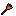 | [Bronze Staff](../source/Engine/Items/WeaponItems/1_Bronze/BronzeStaff.mc) | 17 | 12 | INT | 25 | 2 | INT+3 |
|  | [Bronze Sword](../source/Engine/Items/WeaponItems/1_Bronze/BronzeSword.mc) | 18 | 18 | STR | 25 | 4 | STR+3 CON+1 |

### Tier 2: Fire

| Image | Item | ID | Attack | Scales | Value | Weight | Bonus |
|---|---|---:|---:|---|---:|---:|---|
|  | [Fire Axe](../source/Engine/Items/WeaponItems/2_Fire/FireAxe.mc) | 20 | 21 | STR | 100 | 3 | STR+8 DEX-2 luck-2 |
|  | [Fire Bow](../source/Engine/Items/WeaponItems/2_Fire/FireBow.mc) | 21 | 16 | DEX | 100 | 2 | STR+2 DEX+3 |
|  | [Fire Dagger](../source/Engine/Items/WeaponItems/2_Fire/FireDagger.mc) | 22 | 18 | DEX | 80 | 1 | STR+2 DEX+3 luck+3 |
|  | [Fire Greatsword](../source/Engine/Items/WeaponItems/2_Fire/FireGreatsword.mc) | 23 | 30 | STR | 150 | 6 | STR+9 DEX-4 |
|  | [Fire Katana](../source/Engine/Items/WeaponItems/2_Fire/FireKatana.mc) | 24 | 24 | STR | 100 | 4 | STR+5 DEX+3 |
|  | [Fire Lance](../source/Engine/Items/WeaponItems/2_Fire/FireLance.mc) | 25 | 24 | DEX | 100 | 3 | STR+2 DEX+3 luck+3 |
|  | [Fire Spell](../source/Engine/Items/WeaponItems/2_Fire/FireSpell.mc) | 26 | 21 | INT | 100 | 1 | STR+2 WIS+4 |
|  | [Fire Staff](../source/Engine/Items/WeaponItems/2_Fire/FireStaff.mc) | 27 | 16 | INT | 100 | 2 | STR+2 INT+4 |
|  | [Fire Sword](../source/Engine/Items/WeaponItems/2_Fire/FireSword.mc) | 28 | 24 | STR | 100 | 4 | STR+5 CON+2 |

### Tier 3: Ice

| Image | Item | ID | Attack | Scales | Value | Weight | Bonus |
|---|---|---:|---:|---|---:|---:|---|
|  | [Ice Axe](../source/Engine/Items/WeaponItems/3_Ice/IceAxe.mc) | 30 | 27 | STR | 100 | 3 | STR+4 DEX-2 WIS+4 luck-2 |
|  | [Ice Bow](../source/Engine/Items/WeaponItems/3_Ice/IceBow.mc) | 31 | 20 | DEX | 100 | 2 | DEX+3 WIS+2 |
|  | [Ice Dagger](../source/Engine/Items/WeaponItems/3_Ice/IceDagger.mc) | 32 | 23 | DEX | 80 | 1 | DEX+3 WIS+2 luck+3 |
| 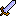 | [Ice Greatsword](../source/Engine/Items/WeaponItems/3_Ice/IceGreatsword.mc) | 33 | 38 | STR | 150 | 6 | STR+5 DEX-4 WIS+4 |
|  | [Ice Katana](../source/Engine/Items/WeaponItems/3_Ice/IceKatana.mc) | 34 | 30 | STR | 100 | 4 | STR+3 DEX+3 WIS+3 |
|  | [Ice Lance](../source/Engine/Items/WeaponItems/3_Ice/IceLance.mc) | 35 | 30 | DEX | 100 | 3 | DEX+3 WIS+2 luck+3 |
|  | [Ice Spell](../source/Engine/Items/WeaponItems/3_Ice/IceSpell.mc) | 36 | 27 | INT | 100 | 1 | WIS+6 |
|  | [Ice Staff](../source/Engine/Items/WeaponItems/3_Ice/IceStaff.mc) | 37 | 20 | INT | 100 | 2 | INT+4 WIS+2 |
|  | [Ice Sword](../source/Engine/Items/WeaponItems/3_Ice/IceSword.mc) | 38 | 30 | STR | 100 | 4 | STR+3 CON+2 WIS+2 |

### Tier 4: Grass

| Image | Item | ID | Attack | Scales | Value | Weight | Bonus |
|---|---|---:|---:|---|---:|---:|---|
|  | [Grass Axe](../source/Engine/Items/WeaponItems/4_Grass/GrassAxe.mc) | 40 | 33 | STR | 100 | 3 | STR+4 DEX-2 CHA+4 |
|  | [Grass Bow](../source/Engine/Items/WeaponItems/4_Grass/GrassBow.mc) | 41 | 25 | DEX | 100 | 2 | DEX+3 CHA+2 luck+1 |
|  | [Grass Dagger](../source/Engine/Items/WeaponItems/4_Grass/GrassDagger.mc) | 42 | 28 | DEX | 80 | 1 | DEX+3 CHA+2 luck+5 |
|  | [Grass Greatsword](../source/Engine/Items/WeaponItems/4_Grass/GrassGreatsword.mc) | 43 | 46 | STR | 150 | 6 | STR+5 CHA+4 luck+2 |
|  | [Grass Katana](../source/Engine/Items/WeaponItems/4_Grass/GrassKatana.mc) | 44 | 37 | STR | 100 | 4 | STR+3 DEX+3 CHA+3 luck+1 |
|  | [Grass Lance](../source/Engine/Items/WeaponItems/4_Grass/GrassLance.mc) | 45 | 37 | DEX | 100 | 3 | DEX+3 CHA+2 luck+5 |
|  | [Grass Spell](../source/Engine/Items/WeaponItems/4_Grass/GrassSpell.mc) | 46 | 33 | INT | 100 | 1 | WIS+3 CHA+3 luck+2 |
| 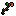 | [Grass Staff](../source/Engine/Items/WeaponItems/4_Grass/GrassStaff.mc) | 47 | 25 | INT | 100 | 2 | INT+4 CHA+2 luck+1 |
|  | [Grass Sword](../source/Engine/Items/WeaponItems/4_Grass/GrassSword.mc) | 48 | 37 | STR | 100 | 4 | STR+3 CON+2 CHA+2 luck+1 |

### Tier 5: Water

| Image | Item | ID | Attack | Scales | Value | Weight | Bonus |
|---|---|---:|---:|---|---:|---:|---|
|  | [Water Axe](../source/Engine/Items/WeaponItems/5_Water/WaterAxe.mc) | 50 | 40 | STR | 100 | 3 | STR+4 DEX-2 INT+4 luck-2 |
|  | [Water Bow](../source/Engine/Items/WeaponItems/5_Water/WaterBow.mc) | 51 | 30 | DEX | 100 | 2 | DEX+3 INT+2 |
|  | [Water Dagger](../source/Engine/Items/WeaponItems/5_Water/WaterDagger.mc) | 52 | 34 | DEX | 80 | 1 | DEX+3 INT+2 luck+3 |
|  | [Water Greatsword](../source/Engine/Items/WeaponItems/5_Water/WaterGreatsword.mc) | 53 | 56 | STR | 150 | 6 | STR+5 DEX-4 INT+4 |
|  | [Water Katana](../source/Engine/Items/WeaponItems/5_Water/WaterKatana.mc) | 54 | 45 | STR | 100 | 4 | STR+3 DEX+3 INT+3 |
|  | [Water Lance](../source/Engine/Items/WeaponItems/5_Water/WaterLance.mc) | 55 | 45 | DEX | 100 | 3 | DEX+3 INT+2 luck+3 |
|  | [Water Spell](../source/Engine/Items/WeaponItems/5_Water/WaterSpell.mc) | 56 | 40 | INT | 100 | 1 | INT+2 WIS+4 |
|  | [Water Staff](../source/Engine/Items/WeaponItems/5_Water/WaterStaff.mc) | 57 | 30 | INT | 100 | 2 | INT+6 |
|  | [Water Sword](../source/Engine/Items/WeaponItems/5_Water/WaterSword.mc) | 58 | 45 | STR | 100 | 4 | STR+3 INT+2 CON+2 |

### Tier 6: Gold

| Image | Item | ID | Attack | Scales | Value | Weight | Bonus |
|---|---|---:|---:|---|---:|---:|---|
|  | [Gold Axe](../source/Engine/Items/WeaponItems/6_Gold/GoldAxe.mc) | 60 | 48 | STR | 500 | 2 | STR+8 DEX-1 luck-1 |
|  | [Gold Bow](../source/Engine/Items/WeaponItems/6_Gold/GoldBow.mc) | 61 | 36 | DEX | 500 | 1 | DEX+4 |
|  | [Gold Dagger](../source/Engine/Items/WeaponItems/6_Gold/GoldDagger.mc) | 62 | 41 | DEX | 400 | 0.5 | DEX+4 luck+4 |
|  | [Gold Greatsword](../source/Engine/Items/WeaponItems/6_Gold/GoldGreatsword.mc) | 63 | 68 | STR | 750 | 7 | STR+6 DEX-2 |
| 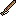 | [Gold Katana](../source/Engine/Items/WeaponItems/6_Gold/GoldKatana.mc) | 64 | 54 | STR | 500 | 4 | STR+5 DEX+5 |
| 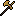 | [Gold Lance](../source/Engine/Items/WeaponItems/6_Gold/GoldLance.mc) | 65 | 54 | DEX | 500 | 2 | DEX+5 luck+5 |
|  | [Gold Spell](../source/Engine/Items/WeaponItems/6_Gold/GoldSpell.mc) | 66 | 48 | INT | 500 | 0.5 | WIS+6 |
|  | [Gold Staff](../source/Engine/Items/WeaponItems/6_Gold/GoldStaff.mc) | 67 | 36 | INT | 500 | 1 | INT+8 |
|  | [Gold Sword](../source/Engine/Items/WeaponItems/6_Gold/GoldSword.mc) | 68 | 54 | STR | 500 | 3 | STR+4 CON+4 |

### Tier 7: Demon

| Image | Item | ID | Attack | Scales | Value | Weight | Bonus |
|---|---|---:|---:|---|---:|---:|---|
|  | [Demon Axe](../source/Engine/Items/WeaponItems/7_Demon/DemonAxe.mc) | 70 | 58 | STR | 2000 | 2 | STR+12 DEX-2 luck-2 |
|  | [Demon Bow](../source/Engine/Items/WeaponItems/7_Demon/DemonBow.mc) | 71 | 43 | DEX | 2000 | 1 | DEX+8 |
|  | [Demon Dagger](../source/Engine/Items/WeaponItems/7_Demon/DemonDagger.mc) | 72 | 49 | DEX | 1600 | 0.5 | DEX+6 luck+6 |
|  | [Demon Greatsword](../source/Engine/Items/WeaponItems/7_Demon/DemonGreatsword.mc) | 73 | 81 | STR | 3000 | 7 | STR+10 DEX-2 |
| 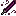 | [Demon Katana](../source/Engine/Items/WeaponItems/7_Demon/DemonKatana.mc) | 74 | 65 | STR | 1000 | 4 | STR+8 DEX+8 |
|  | [Demon Lance](../source/Engine/Items/WeaponItems/7_Demon/DemonLance.mc) | 75 | 65 | DEX | 2000 | 2 | DEX+6 luck+6 |
|  | [Demon Spell](../source/Engine/Items/WeaponItems/7_Demon/DemonSpell.mc) | 76 | 58 | INT | 1000 | 0.5 | WIS+10 |
|  | [Demon Staff](../source/Engine/Items/WeaponItems/7_Demon/DemonStaff.mc) | 77 | 43 | INT | 2000 | 1 | INT+10 |
|  | [Demon Sword](../source/Engine/Items/WeaponItems/7_Demon/DemonSword.mc) | 78 | 65 | STR | 2000 | 3 | STR+6 CON+6 |

### Tier 8: Blood

| Image | Item | ID | Attack | Scales | Value | Weight | Bonus |
|---|---|---:|---:|---|---:|---:|---|
|  | [Blood Axe](../source/Engine/Items/WeaponItems/8_Blood/BloodAxe.mc) | 80 | 69 | STR | 5000 | 2 | STR+16 DEX+2 luck+2 |
|  | [Blood Bow](../source/Engine/Items/WeaponItems/8_Blood/BloodBow.mc) | 81 | 52 | DEX | 5000 | 1 | DEX+20 |
|  | [Blood Dagger](../source/Engine/Items/WeaponItems/8_Blood/BloodDagger.mc) | 82 | 59 | DEX | 4000 | 0.5 | DEX+10 luck+10 |
|  | [Blood Greatsword](../source/Engine/Items/WeaponItems/8_Blood/BloodGreatsword.mc) | 83 | 97 | STR | 7500 | 7 | STR+12 DEX+8 |
|  | [Blood Katana](../source/Engine/Items/WeaponItems/8_Blood/BloodKatana.mc) | 84 | 78 | STR | 5000 | 4 | STR+10 DEX+10 |
|  | [Blood Lance](../source/Engine/Items/WeaponItems/8_Blood/BloodLance.mc) | 85 | 78 | DEX | 5000 | 2 | DEX+10 luck+10 |
|  | [Blood Spell](../source/Engine/Items/WeaponItems/8_Blood/BloodSpell.mc) | 86 | 69 | INT | 5000 | 0.5 | WIS+20 |
|  | [Blood Staff](../source/Engine/Items/WeaponItems/8_Blood/BloodStaff.mc) | 87 | 52 | INT | 5000 | 1 | INT+20 |
|  | [Blood Sword](../source/Engine/Items/WeaponItems/8_Blood/BloodSword.mc) | 88 | 78 | STR | 5000 | 3 | STR+10 CON+10 |

## Armor

### Tier 0: Steel

| Image | Item | ID | Defense | Slot | Scales | Value | Weight | Bonus |
|---|---|---:|---:|---|---|---:|---:|---|
|  | [Steel Helmet](../source/Engine/Items/ArmorItems/Armors/0_Steel/SteelHelmet.mc) | 1000 | 3 | HEAD | CON | 7 | 3 | CON+2 |
|  | [Steel Breastplate](../source/Engine/Items/ArmorItems/Armors/0_Steel/SteelBreastPlate.mc) | 1001 | 3 | CHEST | CON | 10 | 10 | DEX-1 CON+2 |
|  | [Steel Gauntlets](../source/Engine/Items/ArmorItems/Armors/0_Steel/SteelGauntlets.mc) | 1002 | 3 | EITHER_HAND | CHA | 5 | 2 | CHA+2 |
|  | [Steel Shoes](../source/Engine/Items/ArmorItems/Armors/0_Steel/SteelShoes.mc) | 1003 | 3 | FEET | CHA | 7 | 3 | DEX+2 |
|  | [Steel Ring](../source/Engine/Items/ArmorItems/Armors/0_Steel/SteelRing1.mc) | 1004 | 3 | ACCESSORY | WIS | 5 | 0.1 | CON+2 WIS+2 CHA+2 |
|  | [Amethyst Ring](../source/Engine/Items/ArmorItems/Armors/0_Steel/SteelRing2.mc) | 1005 | 2 | ACCESSORY | WIS | 5 | 0.1 | INT+3 WIS+2 |

### Tier 1: Bronze

| Image | Item | ID | Defense | Slot | Scales | Value | Weight | Bonus |
|---|---|---:|---:|---|---|---:|---:|---|
|  | [Bronze Helmet](../source/Engine/Items/ArmorItems/Armors/1_Bronze/BronzeHelmet.mc) | 1010 | 8 | HEAD | CON | 15 | 3.5 | CON+3 |
|  | [Bronze Breastplate](../source/Engine/Items/ArmorItems/Armors/1_Bronze/BronzeBreastPlate.mc) | 1011 | 8 | CHEST | CON | 25 | 12 | DEX-1 CON+3 |
| 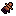 | [Bronze Gauntlets](../source/Engine/Items/ArmorItems/Armors/1_Bronze/BronzeGauntlets.mc) | 1012 | 8 | EITHER_HAND | CHA | 13 | 2.5 | CHA+3 |
|  | [Bronze Shoes](../source/Engine/Items/ArmorItems/Armors/1_Bronze/BronzeShoes.mc) | 1013 | 8 | FEET | CHA | 20 | 3 | DEX+3 |
|  | [Bronze Ring](../source/Engine/Items/ArmorItems/Armors/1_Bronze/BronzeRing1.mc) | 1014 | 7 | ACCESSORY | WIS | 13 | 0.1 | CON+3 WIS+3 CHA+3 |
|  | [Silver Ring](../source/Engine/Items/ArmorItems/Armors/1_Bronze/BronzeRing2.mc) | 1015 | 6 | ACCESSORY | WIS | 13 | 0.1 | INT+4 WIS+3 |

### Tier 2: Fire

| Image | Item | ID | Defense | Slot | Scales | Value | Weight | Bonus |
|---|---|---:|---:|---|---|---:|---:|---|
|  | [Fire Helmet](../source/Engine/Items/ArmorItems/Armors/2_Fire/FireHelmet.mc) | 1020 | 15 | HEAD | CON | 70 | 3 | STR+3 CON+3 |
|  | [Fire Breastplate](../source/Engine/Items/ArmorItems/Armors/2_Fire/FireBreastPlate.mc) | 1021 | 15 | CHEST | CON | 100 | 8 | STR+4 CON+4 |
|  | [Fire Gauntlets](../source/Engine/Items/ArmorItems/Armors/2_Fire/FireGauntlets.mc) | 1022 | 15 | EITHER_HAND | CHA | 50 | 1.5 | STR+3 CHA+3 |
|  | [Fire Shoes](../source/Engine/Items/ArmorItems/Armors/2_Fire/FireShoes.mc) | 1023 | 15 | FEET | CHA | 75 | 3 | STR+3 DEX+3 |
|  | [Mirror Ring](../source/Engine/Items/ArmorItems/Armors/2_Fire/FireRing1.mc) | 1024 | 13 | ACCESSORY | WIS | 50 | 0.1 | STR+4 CON+4 WIS+1 |
|  | [Tourmaline Ring](../source/Engine/Items/ArmorItems/Armors/2_Fire/FireRing2.mc) | 1025 | 11 | ACCESSORY | WIS | 50 | 0.1 | INT+5 CON+4 |

### Tier 3: Ice

| Image | Item | ID | Defense | Slot | Scales | Value | Weight | Bonus |
|---|---|---:|---:|---|---|---:|---:|---|
|  | [Ice Helmet](../source/Engine/Items/ArmorItems/Armors/3_Ice/IceHelmet.mc) | 1030 | 22 | HEAD | CON | 70 | 3 | CON+3 WIS+3 luck+1 |
| 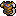 | [Ice Breastplate](../source/Engine/Items/ArmorItems/Armors/3_Ice/IceBreastPlate.mc) | 1031 | 22 | CHEST | CON | 100 | 10 | CON+4 WIS+4 CHA+1 |
|  | [Ice Gauntlets](../source/Engine/Items/ArmorItems/Armors/3_Ice/IceGauntlets.mc) | 1032 | 22 | EITHER_HAND | CHA | 50 | 2 | WIS+4 CHA+3 |
|  | [Ice Shoes](../source/Engine/Items/ArmorItems/Armors/3_Ice/IceShoes.mc) | 1033 | 22 | FEET | CHA | 75 | 3 | DEX+3 CHA+3 luck+1 |
|  | [Mirror Ring](../source/Engine/Items/ArmorItems/Armors/3_Ice/IceRing1.mc) | 1034 | 20 | ACCESSORY | WIS | 50 | 0.1 | CON+1 WIS+3 CHA+6 |
|  | [Glacierite Ring](../source/Engine/Items/ArmorItems/Armors/3_Ice/IceRing2.mc) | 1035 | 17 | ACCESSORY | WIS | 50 | 0.1 | INT+3 WIS+2 CHA+4 |

### Tier 4: Grass

| Image | Item | ID | Defense | Slot | Scales | Value | Weight | Bonus |
|---|---|---:|---:|---|---|---:|---:|---|
|  | [Grass Helmet](../source/Engine/Items/ArmorItems/Armors/4_Grass/GrassHelmet.mc) | 1040 | 30 | HEAD | CON | 70 | 3 | CON+2 CHA+2 luck+2 |
|  | [Grass Breastplate](../source/Engine/Items/ArmorItems/Armors/4_Grass/GrassBreastPlate.mc) | 1041 | 30 | CHEST | CON | 100 | 8 | CON+3 CHA+3 luck+2 |
|  | [Grass Gauntlets](../source/Engine/Items/ArmorItems/Armors/4_Grass/GrassGauntlets.mc) | 1042 | 30 | EITHER_HAND | CHA | 50 | 1.5 | CHA+5 luck+1 |
|  | [Grass Shoes](../source/Engine/Items/ArmorItems/Armors/4_Grass/GrassShoes.mc) | 1043 | 30 | FEET | CHA | 75 | 3 | DEX+3 CHA+3 luck+1 |
|  | [Grass Ring](../source/Engine/Items/ArmorItems/Armors/4_Grass/GrassRing1.mc) | 1044 | 27 | ACCESSORY | WIS | 50 | 0.1 | CON+2 CHA+6 luck+2 |
|  | [Corruption Ring](../source/Engine/Items/ArmorItems/Armors/4_Grass/GrassRing2.mc) | 1045 | 23 | ACCESSORY | WIS | 50 | 0.1 | INT+4 CHA+4 luck+2 |

### Tier 5: Water

| Image | Item | ID | Defense | Slot | Scales | Value | Weight | Bonus |
|---|---|---:|---:|---|---|---:|---:|---|
|  | [Water Helmet](../source/Engine/Items/ArmorItems/Armors/5_Water/WaterHelmet.mc) | 1050 | 38 | HEAD | CON | 70 | 3 | INT+3 CON+3 |
|  | [Water Breastplate](../source/Engine/Items/ArmorItems/Armors/5_Water/WaterBreastPlate.mc) | 1051 | 38 | CHEST | CON | 100 | 8 | INT+4 CON+4 |
|  | [Water Gauntlets](../source/Engine/Items/ArmorItems/Armors/5_Water/WaterGauntlets.mc) | 1052 | 38 | EITHER_HAND | CHA | 50 | 2 | INT+3 CHA+3 |
|  | [Water Shoes](../source/Engine/Items/ArmorItems/Armors/5_Water/WaterShoes.mc) | 1053 | 38 | FEET | CHA | 75 | 3 | DEX+3 INT+3 |
|  | [Sapphire Ring](../source/Engine/Items/ArmorItems/Armors/5_Water/WaterRing1.mc) | 1054 | 34 | ACCESSORY | WIS | 50 | 0.1 | INT+5 CON+4 |
|  | [Obsidian Ring](../source/Engine/Items/ArmorItems/Armors/5_Water/WaterRing2.mc) | 1055 | 29 | ACCESSORY | WIS | 50 | 0.1 | INT+4 WIS+5 |

### Tier 6: Gold

| Image | Item | ID | Defense | Slot | Scales | Value | Weight | Bonus |
|---|---|---:|---:|---|---|---:|---:|---|
|  | [Gold Helmet](../source/Engine/Items/ArmorItems/Armors/6_Gold/GoldHelmet.mc) | 1060 | 47 | HEAD | CON | 35 | 3 | CON+8 |
|  | [Gold Breastplate](../source/Engine/Items/ArmorItems/Armors/6_Gold/GoldBreastPlate.mc) | 1061 | 47 | CHEST | CON | 500 | 15 | STR+3 DEX-5 CON+10 |
|  | [Gold Gauntlets](../source/Engine/Items/ArmorItems/Armors/6_Gold/GoldGauntlets.mc) | 1062 | 47 | EITHER_HAND | CHA | 28 | 2 | CHA+8 |
|  | [Gold Shoes](../source/Engine/Items/ArmorItems/Armors/6_Gold/GoldShoes.mc) | 1063 | 47 | FEET | CHA | 35 | 3 | DEX+8 |
|  | [Gold Ring](../source/Engine/Items/ArmorItems/Armors/6_Gold/GoldRing1.mc) | 1064 | 42 | ACCESSORY | WIS | 28 | 0.1 | CON+8 WIS+8 CHA+8 |
|  | [Amethyst Gold Ring](../source/Engine/Items/ArmorItems/Armors/6_Gold/GoldRing2.mc) | 1065 | 36 | ACCESSORY | WIS | 30 | 0.1 | INT+9 WIS+8 |

### Tier 7: Demon

| Image | Item | ID | Defense | Slot | Scales | Value | Weight | Bonus |
|---|---|---:|---:|---|---|---:|---:|---|
|  | [Demon Helmet](../source/Engine/Items/ArmorItems/Armors/7_Demon/DemonHelmet.mc) | 1070 | 57 | HEAD | CON | 1000 | 5 | STR+5 WIS-5 CHA+10 |
| 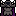 | [Demon Breastplate](../source/Engine/Items/ArmorItems/Armors/7_Demon/DemonBreastPlate.mc) | 1071 | 57 | CHEST | CON | 2000 | 20 | STR+5 INT-5 CON+15 WIS-5 |
| 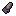 | [Ice Gauntlets](../source/Engine/Items/ArmorItems/Armors/7_Demon/DemonGauntlets.mc) | 1072 | 57 | EITHER_HAND | CHA | 500 | 3 | STR+5 INT-5 WIS-5 CHA+10 |
|  | [Demon Shoes](../source/Engine/Items/ArmorItems/Armors/7_Demon/DemonShoes.mc) | 1073 | 57 | FEET | CHA | 1200 | 3 | STR+7 DEX+7 WIS-5 |
|  | [Demon Ring](../source/Engine/Items/ArmorItems/Armors/7_Demon/DemonRing1.mc) | 1074 | 51 | ACCESSORY | WIS | 700 | 0.1 | STR+7 CON+5 WIS-5 |
|  | [Death Ring](../source/Engine/Items/ArmorItems/Armors/7_Demon/DemonRing2.mc) | 1075 | 43 | ACCESSORY | WIS | 700 | 0.1 | STR+7 INT+5 WIS-5 |

### Tier 8: Blood

| Image | Item | ID | Defense | Slot | Scales | Value | Weight | Bonus |
|---|---|---:|---:|---|---|---:|---:|---|
|  | [Blood Helmet](../source/Engine/Items/ArmorItems/Armors/8_Blood/BloodHelmet.mc) | 1080 | 68 | HEAD | CON | 3000 | 3 | STR+5 CON+10 |
|  | [Blood Breastplate](../source/Engine/Items/ArmorItems/Armors/8_Blood/BloodBreastPlate.mc) | 1081 | 68 | CHEST | CON | 5000 | 8 | STR+5 CON+20 |
|  | [Blood Gauntlets](../source/Engine/Items/ArmorItems/Armors/8_Blood/BloodGauntlets.mc) | 1082 | 68 | EITHER_HAND | CHA | 2000 | 2 | STR+5 CON+5 CHA+10 |
|  | [Blood Shoes](../source/Engine/Items/ArmorItems/Armors/8_Blood/BloodShoes.mc) | 1083 | 68 | FEET | CHA | 1200 | 3 | STR+7 DEX+10 |
|  | [Demon Blood Ring](../source/Engine/Items/ArmorItems/Armors/8_Blood/BloodRing1.mc) | 1084 | 61 | ACCESSORY | WIS | 2500 | 0.1 | STR+10 CON+5 |
|  | [Blood Magic Ring](../source/Engine/Items/ArmorItems/Armors/8_Blood/BloodRing2.mc) | 1085 | 52 | ACCESSORY | WIS | 2500 | 0.1 | INT+10 CON+5 |

## Crossbows

| Image | Item | ID | Attack | Scales | Value | Weight | Bonus |
|---|---|---:|---:|---|---:|---:|---|
| 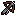 | [Oak Crossbow](../source/Engine/Items/WeaponItems/Crossbow/CrossBowOak.mc) | 301 | 15 | DEX | 14 | 4 | STR+3 CHA+3 |
|  | [Hell Crossbow](../source/Engine/Items/WeaponItems/Crossbow/CrossBowHell.mc) | 302 | 20 | DEX | 14 | 4 | STR+5 CHA+5 |

## Ammunition

| Image | Item | ID | Attack | Scales | Value | Weight | Bonus |
|---|---|---:|---:|---|---:|---:|---|
|  | [Arrow](../source/Engine/Items/WeaponItems/Ammunition/Arrow.mc) | 200 | 4 | STR | 5 | - | - |
|  | [Fire Arrow](../source/Engine/Items/WeaponItems/Ammunition/FireArrow.mc) | 201 | 2 | STR | 0 | - | - |
|  | [Ice Arrow](../source/Engine/Items/WeaponItems/Ammunition/IceArrow.mc) | 202 | 2 | STR | 0 | - | - |
|  | [Gold Arrow](../source/Engine/Items/WeaponItems/Ammunition/GoldArrow.mc) | 203 | 15 | STR | 50 | - | - |
|  | [Bolt](../source/Engine/Items/WeaponItems/Ammunition/Bolt.mc) | 250 | 4 | STR | 0 | - | - |
| 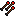 | [Fire Bolt](../source/Engine/Items/WeaponItems/Ammunition/FireBolt.mc) | 251 | 2 | STR | 0 | - | - |
|  | [Ice Bolt](../source/Engine/Items/WeaponItems/Ammunition/IceBolt.mc) | 252 | 2 | STR | 0 | - | - |
|  | [Gold Bolt](../source/Engine/Items/WeaponItems/Ammunition/GoldBolt.mc) | 253 | 15 | STR | 50 | - | - |

## Shields

| Image | Item | ID | Defense | Slot | Scales | Value | Weight | Bonus |
|---|---|---:|---:|---|---|---:|---:|---|
|  | [Shield](../source/Engine/Items/ArmorItems/Shield/WoodShield.mc) | 1200 | 3 | LEFT_HAND | CON | 5 | 1.5 | DEX-1 CON+3 |
|  | [Steel Shield](../source/Engine/Items/ArmorItems/Shield/SteelShield.mc) | 1201 | 7 | LEFT_HAND | CON | 50 | 2.5 | DEX-2 CON+3 |
|  | [Silver Shield](../source/Engine/Items/ArmorItems/Shield/SilverShield.mc) | 1202 | 8 | LEFT_HAND | CON | 100 | 3.5 | DEX-2 CON+4 |
|  | [Gold Shield](../source/Engine/Items/ArmorItems/Shield/GoldShield.mc) | 1203 | 47 | LEFT_HAND | CON | 500 | 5 | DEX-2 CON+6 luck+5 |

## Backpacks

| Image | Item | ID | Defense | Slot | Scales | Value | Weight | Bonus |
|---|---|---:|---:|---|---|---:|---:|---|
|  | [Green Backpack](../source/Engine/Items/ArmorItems/Backpack/GreenBackpack.mc) | 1250 | 0 | BACK | CON | 100 | 0.5 | - |
|  | [Purple Backpack](../source/Engine/Items/ArmorItems/Backpack/PurpleBackpack.mc) | 1251 | 0 | BACK | CON | 500 | 0.5 | - |
|  | [Gold Backpack](../source/Engine/Items/ArmorItems/Backpack/GoldBackpack.mc) | 1252 | 0 | BACK | CON | 2500 | 0.5 | DEX-3 CON+2 luck+5 |

## Amulets & Accessories

| Image | Item | ID | Defense | Slot | Scales | Value | Weight | Bonus |
|---|---|---:|---:|---|---|---:|---:|---|
|  | [Life Amulet](../source/Engine/Items/ArmorItems/LifeAmulet.mc) | 1300 | 0 | ACCESSORY | CON | 100 | 0.5 | CON+1 |
|  | [Mana Crystal](../source/Engine/Items/ArmorItems/ManaCrystal.mc) | 1301 | 0 | ACCESSORY | CON | 100 | 0.5 | CON+1 |

## Custom Items

| Image | Item | ID | Attack | Scales | Value | Weight | Bonus |
|---|---|---:|---:|---|---:|---:|---|
|  | [Night Pike](../source/Engine/Items/Custom/WeaponItems/NightPike.mc) | 303 | 10 | STR | 10 | 1 | - |

## Consumables

| Image | Item | ID | Effect | Value | Weight |
|---|---|---:|---|---:|---:|
|  | [Health Potion](../source/Engine/Items/ConsumableItems/HealthPotion.mc) | 2000 | Restores 20 health | 20 | 0.1 |
|  | [Mana Potion](../source/Engine/Items/ConsumableItems/ManaPotion.mc) | 2001 | Restores 20 mana | 20 | 0.1 |
|  | [Greater Health Potion](../source/Engine/Items/ConsumableItems/GreaterHealthPotion.mc) | 2002 | Restores 80 health | 80 | 0.5 |
|  | [Mana Potion](../source/Engine/Items/ConsumableItems/GreaterManaPotion.mc) | 2003 | Restores 80 mana | 80 | 0.5 |
|  | [Max Health Potion](../source/Engine/Items/ConsumableItems/MaxHealthPotion.mc) | 2004 | Restores all health | 200 | 1 |
|  | [Max Mana Potion](../source/Engine/Items/ConsumableItems/MaxManaPotion.mc) | 2005 | Restores all mana | 200 | 1 |

## Special Items

| Image | Item | ID | Description | Value | Weight |
|---|---|---:|---|---:|---:|
| 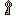 | [Key](../source/Engine/Items/SpecialItems/Key.mc) | 3000 | Opens treasure chests. | 0 | 0.01 |
|  | [Gold](../source/Engine/Items/SpecialItems/Gold.mc) | 5000 | Used to pay for goods. | 0 | 0 |
|  | [Treasure Chest](../source/Engine/Items/SpecialItems/TreasureChest.mc) | 6000 | A sturdy chest. It might hold something valuable. | 0 | 0 |

## Item Drop Weights

Current tiered drop weights from `ItemSpecificValues.mc` (`build*Weights`).

### Weapons

| Weight | Item IDs | Tiers (depth <= max: weight) |
|---|---|---|
| steel_weight | 0, 1, 2, 3, 4, 5, 6, 7, 8 | ≤6: 12, ≤12: 9, ≤18: 5, ≤999: 2 |
| bronze_weight | 10, 11, 12, 13, 14, 15, 16, 17, 18 | ≤10: 0, ≤18: 10, ≤999: 3 |
| fire_weight | 20, 21, 22, 23, 24, 25, 26, 27, 28 | ≤20: 0, ≤28: 7, ≤999: 6 |
| ice_weight | 30, 31, 32, 33, 34, 35, 36, 37, 38 | ≤30: 0, ≤38: 7, ≤999: 6 |
| grass_weight | 40, 41, 42, 43, 44, 45, 46, 47, 48 | ≤40: 0, ≤48: 6, ≤999: 5 |
| water_weight | 50, 51, 52, 53, 54, 55, 56, 57, 58 | ≤50: 0, ≤58: 6, ≤999: 5 |
| gold_weight | 60, 61, 62, 63, 64, 65, 66, 67, 68 | ≤60: 0, ≤68: 7, ≤999: 6 |
| demon_weight | 70, 71, 72, 73, 74, 75, 76, 77, 78 | ≤70: 0, ≤78: 7, ≤999: 7 |
| blood_weight | 80, 81, 82, 83, 84, 85, 86, 87, 88 | ≤80: 0, ≤88: 7, ≤999: 7 |
| arrow_weight | 200 | ≤5: 8, ≤12: 10, ≤999: 12 |
| elemental_arrow_weight | 201, 202, 203 | ≤7: 0, ≤14: 6, ≤22: 8, ≤999: 8 |
| bolt_weight | 250 | ≤5: 8, ≤12: 10, ≤999: 12 |
| elemental_bolt_weight | 251, 252, 253 | ≤7: 0, ≤14: 6, ≤22: 8, ≤999: 8 |
| crossbow_weight | 300 | ≤6: 0, ≤12: 6, ≤20: 7, ≤999: 6 |
| oak_crossbow_weight | 301 | ≤8: 0, ≤16: 6, ≤24: 7, ≤999: 6 |
| hell_crossbow_weight | 302 | ≤14: 0, ≤22: 5, ≤999: 7 |
| inline | 303 | ≤8: 6, ≤18: 7, ≤999: 5 |

### Armor

| Weight | Item IDs | Tiers (depth <= max: weight) |
|---|---|---|
| steel_armor | 1000, 1001, 1002, 1003 | ≤6: 10, ≤12: 8, ≤18: 5, ≤999: 3 |
| steel_ring | 1004, 1005 | ≤6: 8, ≤12: 7, ≤18: 6, ≤999: 4 |
| bronze_armor | 1010, 1011, 1012, 1013 | ≤10: 0, ≤18: 9, ≤999: 3 |
| bronze_ring | 1014, 1015 | ≤10: 0, ≤18: 7, ≤999: 3 |
| fire_armor | 1020, 1021, 1022, 1023 | ≤20: 0, ≤28: 6, ≤999: 6 |
| fire_ring | 1024, 1025 | ≤20: 0, ≤28: 5, ≤999: 6 |
| ice_armor | 1030, 1031, 1032, 1033 | ≤30: 0, ≤38: 6, ≤999: 6 |
| ice_ring | 1034, 1035 | ≤30: 0, ≤38: 5, ≤999: 6 |
| grass_armor | 1040, 1041, 1042, 1043 | ≤40: 0, ≤48: 6, ≤999: 5 |
| grass_ring | 1044, 1045 | ≤40: 0, ≤48: 5, ≤999: 5 |
| water_armor | 1050, 1051, 1052, 1053 | ≤50: 0, ≤58: 6, ≤999: 5 |
| water_ring | 1054, 1055 | ≤50: 0, ≤58: 5, ≤999: 5 |
| gold_armor | 1060, 1061, 1062, 1063 | ≤60: 0, ≤68: 8, ≤999: 7 |
| gold_ring | 1064, 1065 | ≤60: 0, ≤68: 7, ≤999: 7 |
| demon_armor | 1070, 1071, 1072, 1073 | ≤70: 0, ≤78: 8, ≤999: 8 |
| demon_ring | 1074, 1075 | ≤70: 0, ≤78: 7, ≤999: 7 |
| blood_armor | 1080, 1081, 1082, 1083 | ≤80: 0, ≤88: 8, ≤999: 8 |
| blood_ring | 1084, 1085 | ≤80: 0, ≤88: 7, ≤999: 7 |

### Consumables

| Weight | Item IDs | Tiers (depth <= max: weight) |
|---|---|---|
| inline | 2000 | ≤8: 1062, ≤18: 3126, ≤30: 72, ≤60: 2, ≤999: 0 |
| inline | 2001 | ≤8: 850, ≤18: 3908, ≤30: 72, ≤999: 5 |
| inline | 2002 | ≤9: 0, ≤18: 2314, ≤30: 72, ≤60: 5, ≤999: 0 |
| inline | 2003 | ≤9: 0, ≤18: 2269, ≤30: 72, ≤999: 5 |
| inline | 2004 | ≤39: 0, ≤60: 177, ≤100: 5, ≤999: 4 |
| inline | 2005 | ≤39: 0, ≤60: 177, ≤999: 5 |
| inline | 3000 | ≤8: 7, ≤20: 6, ≤999: 5 |
| 8 + Math.log(depth + 1, 2) | 5000 | — |

### High Quality

| Weight | Item IDs | Tiers (depth <= max: weight) |
|---|---|---|
| water_weight / 2 | 53, 55, 58 | ≤50: 0, ≤58: 3, ≤999: 2.5 |
| gold_weight / 2 | 63, 65, 68 | ≤60: 0, ≤68: 3.5, ≤999: 3 |
| demon_weight / 2 | 73, 75, 78 | ≤70: 0, ≤78: 3.5, ≤999: 3.5 |
| blood_weight / 2 | 83, 85, 88 | ≤80: 0, ≤88: 3.5, ≤999: 3.5 |
| water_ring / 2 | 1054, 1055 | ≤50: 0, ≤58: 2.5, ≤999: 2.5 |
| gold_ring / 2 | 1064, 1065 | ≤60: 0, ≤68: 3.5, ≤999: 3.5 |
| demon_ring / 2 | 1074, 1075 | ≤70: 0, ≤78: 3.5, ≤999: 3.5 |
| blood_ring / 2 | 1084, 1085 | ≤80: 0, ≤88: 3.5, ≤999: 3.5 |
| inline | 1300 | ≤8: 0, ≤16: 2, ≤999: 2 |
| inline | 1301 | ≤8: 0, ≤16: 3, ≤999: 4 |
| consumable_weights[2003] / 2 | 2003 | ≤9: 0, ≤18: 1134.5, ≤30: 36, ≤999: 2.5 |
| consumable_weights[2004] / 2 | 2004 | ≤39: 0, ≤60: 88.5, ≤100: 2.5, ≤999: 2 |
| consumable_weights[2005] / 2 | 2005 | ≤39: 0, ≤60: 88.5, ≤999: 2.5 |

### Merchant

| Weight | Item IDs | Tiers (depth <= max: weight) |
|---|---|---|
| steel_weight | 0, 3, 8 | ≤6: 12, ≤12: 9, ≤18: 6, ≤999: 2 |
| bronze_weight | 10, 13, 18 | ≤10: 0, ≤18: 10, ≤999: 3 |
| fire_weight | 23, 28 | ≤20: 0, ≤28: 7, ≤999: 6 |
| ice_weight | 33, 38 | ≤30: 0, ≤38: 7, ≤999: 6 |
| grass_weight | 43, 48 | ≤40: 0, ≤48: 6, ≤999: 5 |
| water_weight | 53, 58 | ≤50: 0, ≤58: 6, ≤999: 5 |
| gold_weight | 63, 68 | ≤60: 0, ≤68: 7, ≤999: 6 |
| arrow_weight | 200 | ≤5: 8, ≤12: 10, ≤999: 12 |
| elemental_arrow_weight | 201, 202, 203 | ≤7: 0, ≤14: 6, ≤22: 8, ≤999: 6 |
| bolt_weight | 250 | ≤5: 8, ≤12: 10, ≤999: 12 |
| elemental_bolt_weight | 251, 252, 253 | ≤7: 0, ≤14: 6, ≤22: 8, ≤999: 6 |
| crossbow_weight | 300 | ≤6: 0, ≤12: 6, ≤20: 7, ≤999: 6 |
| oak_crossbow_weight | 301 | ≤8: 0, ≤16: 6, ≤24: 7, ≤999: 6 |
| hell_crossbow_weight | 302 | ≤14: 0, ≤22: 5, ≤999: 7 |
| steel_armor | 1000, 1001, 1002, 1003 | ≤6: 10, ≤12: 8, ≤18: 5, ≤999: 3 |
| steel_ring | 1004, 1005 | ≤6: 8, ≤12: 7, ≤18: 6, ≤999: 4 |
| bronze_armor | 1010, 1011, 1012, 1013 | ≤10: 0, ≤18: 9, ≤999: 3 |
| bronze_ring | 1014, 1015 | ≤10: 0, ≤18: 7, ≤999: 3 |
| fire_armor | 1020, 1021, 1022, 1023 | ≤20: 0, ≤28: 6, ≤999: 6 |
| fire_ring | 1024, 1025 | ≤20: 0, ≤28: 5, ≤999: 6 |
| ice_armor | 1030, 1031, 1032, 1033 | ≤30: 0, ≤38: 6, ≤999: 6 |
| ice_ring | 1034, 1035 | ≤30: 0, ≤38: 5, ≤999: 6 |
| grass_armor | 1040, 1041, 1042, 1043 | ≤40: 0, ≤48: 6, ≤999: 5 |
| grass_ring | 1044, 1045 | ≤40: 0, ≤48: 5, ≤999: 5 |
| water_armor | 1050, 1051, 1052, 1053 | ≤50: 0, ≤58: 6, ≤999: 5 |
| water_ring | 1054, 1055 | ≤50: 0, ≤58: 5, ≤999: 5 |
| gold_armor | 1060, 1061, 1062, 1063 | ≤60: 0, ≤68: 8, ≤999: 7 |
| gold_ring | 1064, 1065 | ≤60: 0, ≤68: 7, ≤999: 7 |

